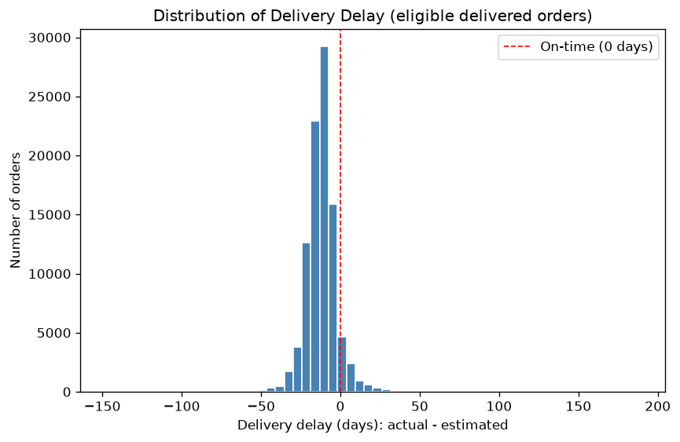
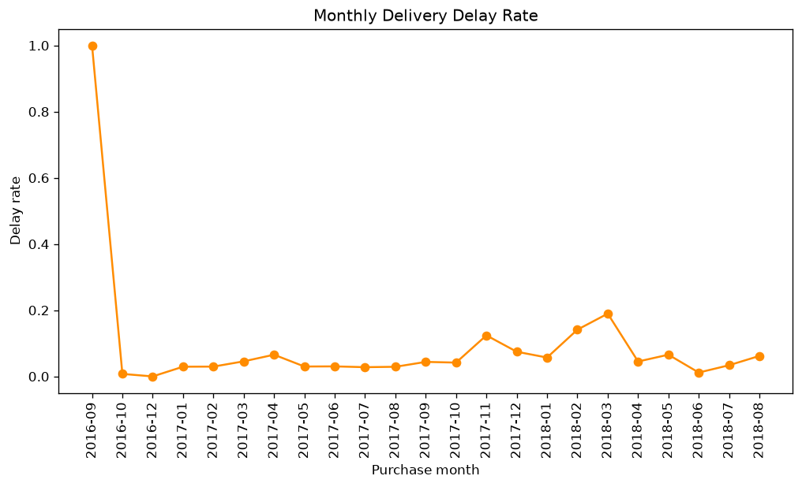
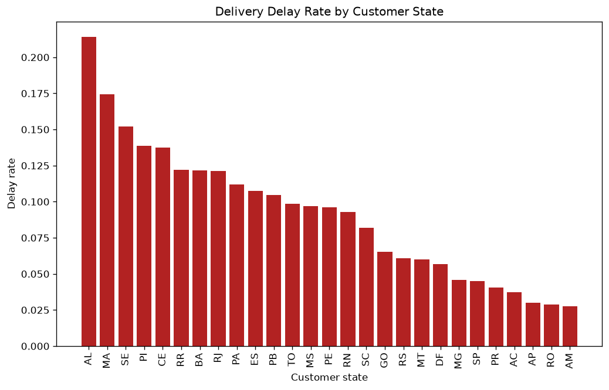
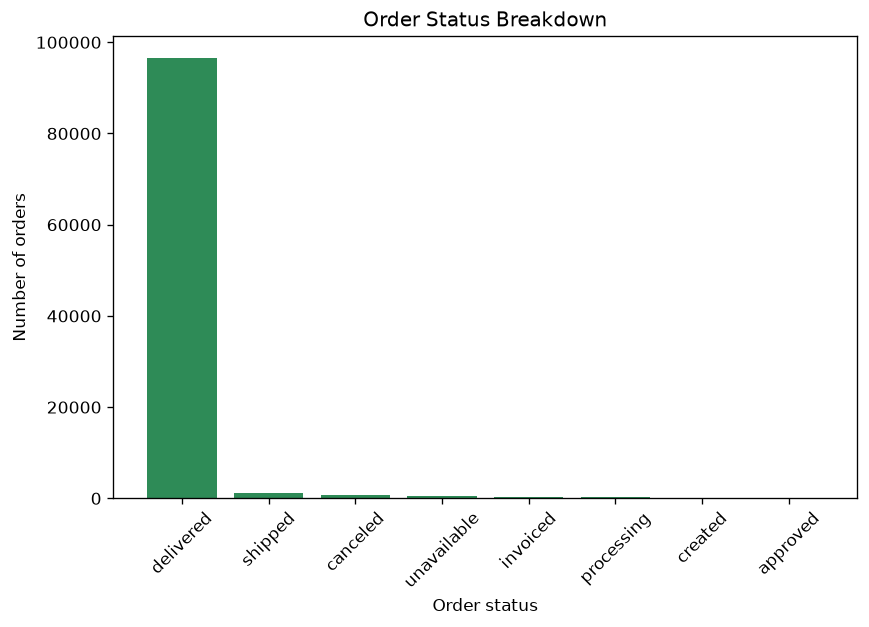

# Task 2.1 — Business EDA Report

Grain: `order_id`. Eligible orders for delay analysis (delivered with both approved/delivered dates): **96,470** out of 99,441 total orders.

## 1. Delivery Delay Distribution

- Mean: -11.88 days | Std: 10.18
- P10: -22.0 | P25: -17.0 | P50 (median): -12.0 | P75: -7.0 | P90: -2.0
- Negative values mean orders arrived *earlier* than the estimated delivery date.

## 2. Monthly Delay Trend

⚠️ Months with very low order volume (n < 50), treat as statistically unreliable: 2016-09, 2016-12.

## 3. Delay Rate by Customer State

Top 5 worst delay rates:

| customer_state   |   n_orders |   delay_rate |   avg_delay_days |
|:-----------------|-----------:|-------------:|-----------------:|
| AL               |        397 |     0.214106 |         -8.70781 |
| MA               |        717 |     0.174338 |         -9.57183 |
| SE               |        335 |     0.152239 |        -10.0209  |
| PI               |        476 |     0.138655 |        -11.3067  |
| CE               |       1279 |     0.137608 |        -10.8045  |

⚠️ States with very low order volume (n < 100), treat delay rate as statistically unreliable: RR, AC, AP.

## 4. Order Status Breakdown

| order_status   |   n_orders |   n_no_items |   pct_of_total |   pct_no_items_within_status |
|:---------------|-----------:|-------------:|---------------:|-----------------------------:|
| delivered      |      96478 |            0 |          97.02 |                         0    |
| shipped        |       1107 |            1 |           1.11 |                         0.09 |
| canceled       |        625 |          164 |           0.63 |                        26.24 |
| unavailable    |        609 |          603 |           0.61 |                        99.01 |
| invoiced       |        314 |            2 |           0.32 |                         0.64 |
| processing     |        301 |            0 |           0.3  |                         0    |
| created        |          5 |            5 |           0.01 |                       100    |
| approved       |          2 |            0 |           0    |                         0    |

Total orders with zero items: **775**. Concentrated mostly in `unavailable` and `canceled`, as expected. Note: `shipped` (1) and `invoiced` (2) with zero items are data-quality anomalies worth flagging.

## 5. Review Score vs Delivery Delay

- Orders with both a review and a valid delay: **95,824**
- Pearson correlation (delay vs review_score): **-0.267**
- Interpretation: longer delays are associated with lower review scores (moderate negative correlation).
